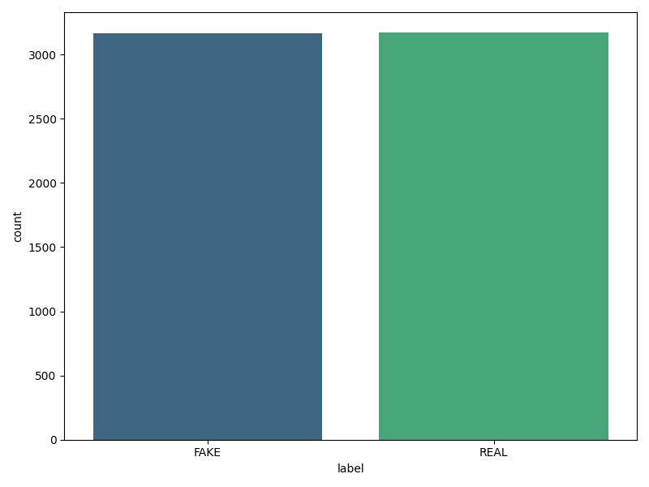

# Fake News Detection

## Description

This is an educational project focused on fake news detection. The goal of this project is to demonstrate the application of text processing and machine learning techniques. The project uses TF-IDF vectorization and a Passive Aggressive classifier to classify news articles as either "REAL" or "FAKE".

## Project Goals

- **Learning:** Demonstrate the application of text processing and machine learning methods in practice.
- **Practice:** Exercise in data preprocessing, text vectorization, and model building.
- **Visualization:** Create visualizations for data analysis and model evaluation.

## Contents

- [Installation](#installation)
- [Usage](#usage)
- [Features](#features)
- [Results](#results)
- [License](#license)

## Installation

To set up and run the project, follow these steps:

1. **Clone the repository:**

    ```bash
    git clone https://github.com/your_username/fake_news_detection.git
    cd fake_news_detection
    ```

2. **Create a virtual environment (optional but recommended):**

    ```bash
    python -m venv venv
    ```

3. **Activate the virtual environment:**

    - On Windows:

      ```bash
      venv\Scripts\activate
      ```

    - On macOS/Linux:

      ```bash
      source venv/bin/activate
      ```

4. **Install the required packages:**

    ```bash
    pip install -r requirements.txt
    ```

## Usage

To run the project, follow these steps:

1. **Prepare your dataset:**

   Place your CSV file (e.g., `fake_news.csv`) in the project directory.

2. **Run the main script:**

    ```bash
    python main.py
    ```

   This will execute the script, train the model, and generate visualizations.

3. **Optionally:**

   If you want to view the generated plots, follow the prompts at the end of the script to open the plot folder.

## Features

- **Text Preprocessing:** Cleaning and preparing text data for analysis.
- **Feature Extraction:** TF-IDF vectorization for feature extraction.
- **Model Training:** Training a Passive Aggressive classifier.
- **Evaluation:** Assessing model performance using accuracy, confusion matrix, ROC curve, and AUC.
- **Visualization:** Creating and saving plots for data analysis and model evaluation.

## Results

After running the script, the following results will be available:

- **Distribution of Real and Fake News:** Shows the count of each class.
- **Top 20 Most Frequent Words:** Displays the most common words in the dataset.
- **TF-IDF Features:** Heatmap of TF-IDF values for the top 20 words.
- **Model Accuracy:** Plot of training and test accuracy.
- **Confusion Matrix:** Matrix showing model predictions compared to actual labels.
- **ROC Curve:** Plot showing the relationship between true positive and false positive rates.

## Images

### Distribution of Labels

This plot shows the distribution of real and fake news labels in the dataset.



### Most Frequent Words

This bar chart illustrates the top 20 most frequent words in the dataset.


### TF-IDF Heatmap

This heatmap visualizes TF-IDF scores for the top 20 words across the first 100 texts.


### Model Accuracy

This bar chart displays the accuracy of the model on training and testing datasets.


### Confusion Matrix

The confusion matrix shows the performance of the model in classifying real and fake news.


### ROC Curve

The ROC curve illustrates the trade-off between the true positive rate and false positive rate of the model.


## License

This project is licensed under the MIT License - see the [LICENSE](LICENSE) file for details.

---

**This project is intended for educational purposes only and should not be considered a ready-made solution for real-world applications.**
