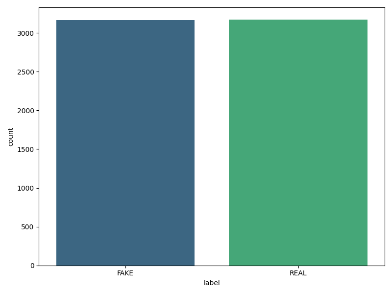
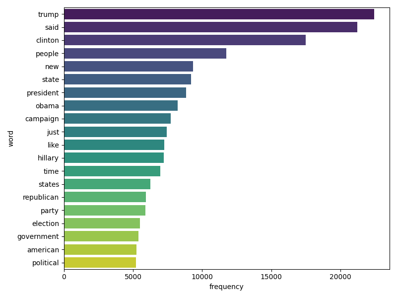
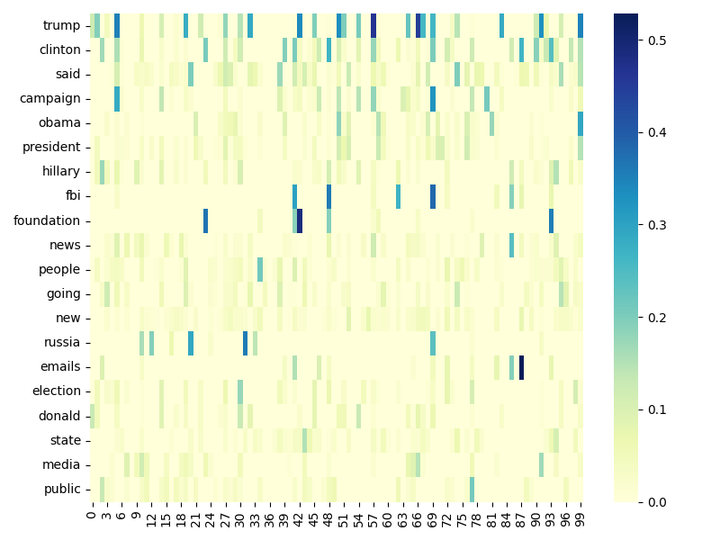
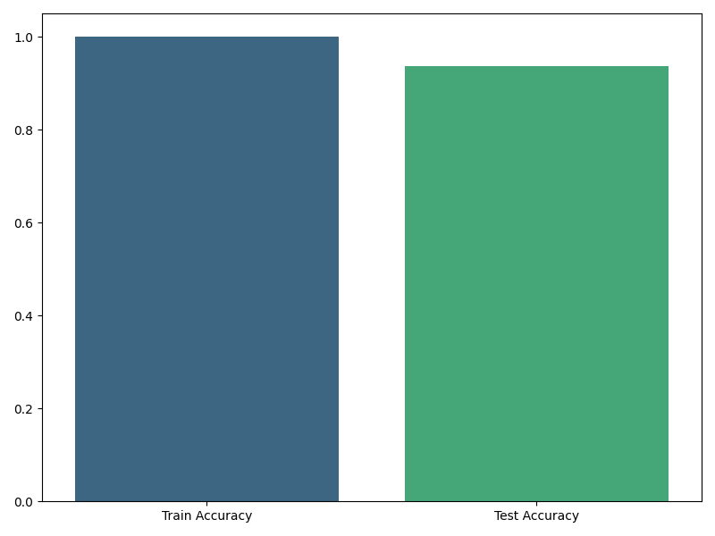
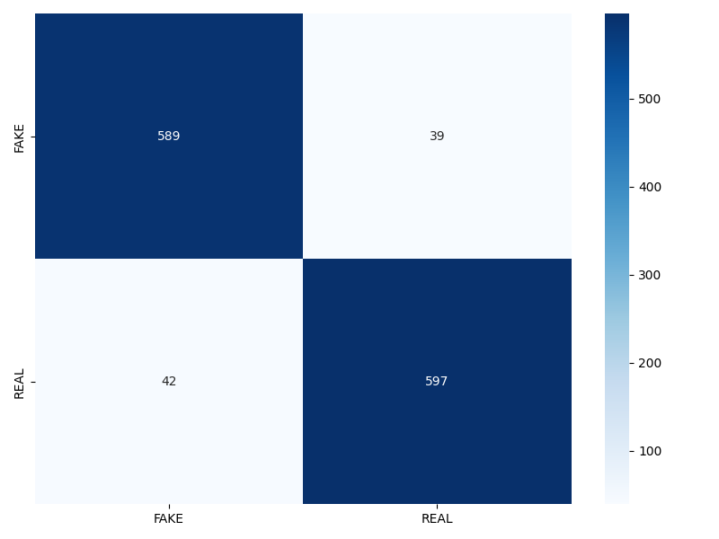
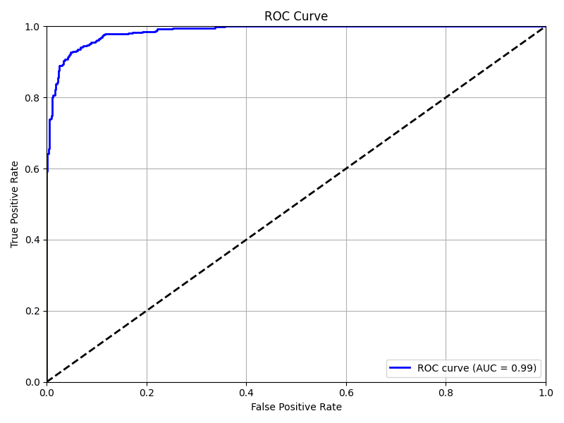

# Обнаружение фейковых новостей

## Описание

Этот проект представляет собой учебный проект, посвященный обнаружению фейковых новостей. Целью этого проекта является демонстрация применения методов машинного обучения и обработки текста на практике. В проекте используются методы векторизации TF-IDF и классификатор Passive Aggressive для классификации новостных статей как "РЕАЛЬНЫЕ" или "ФЕЙКОВЫЕ".

## Цели проекта

- **Обучение:** Демонстрация применения методов обработки текста и машинного обучения на практике.
- **Практика:** Упражнение в предобработке данных, векторизации текстов и построении моделей.
- **Визуализация:** Создание визуализаций для анализа данных и оценки качества модели.

## Содержание

- [Установка](#установка)
- [Использование](#использование)
- [Особенности](#особенности)
- [Результаты](#результаты)
- [Лицензия](#лицензия)

## Установка

Для запуска проекта выполните следующие шаги:

1. **Клонируйте репозиторий:**

    ```bash
    git clone https://github.com/ваш_пользователь/fake_news_detection.git
    cd fake_news_detection
    ```

2. **Создайте виртуальное окружение (опционально, но рекомендуется):**

    ```bash
    python -m venv venv
    ```

3. **Активируйте виртуальное окружение:**

    - На Windows:

      ```bash
      venv\Scripts\activate
      ```

    - На macOS/Linux:

      ```bash
      source venv/bin/activate
      ```

4. **Установите необходимые пакеты:**

    ```bash
    pip install -r requirements.txt
    ```

## Использование

Для запуска проекта выполните следующие шаги:

1. **Подготовьте ваш набор данных:**

   Поместите ваш CSV-файл с данными (например, `fake_news.csv`) в каталог проекта.

2. **Запустите основной скрипт:**

    ```bash
    python main.py
    ```

   Это выполнит скрипт, обучит модель и создаст визуализации.

3. **Опционально:**

   Если вы хотите просмотреть созданные графики, следуйте подсказкам в конце скрипта для открытия папки с графиками.

## Особенности

- **Предобработка текста:** Очистка и подготовка текстовых данных для анализа.
- **Извлечение признаков:** Используется векторизация TF-IDF для извлечения признаков.
- **Обучение модели:** Обучение классификатора Passive Aggressive.
- **Оценка:** Оценка производительности модели с помощью точности, матрицы ошибок, кривой ROC и AUC.
- **Визуализация:** Создание и сохранение графиков для анализа данных и оценки модели.

## Результаты

После выполнения скрипта будут доступны следующие результаты:

- **Распределение реальных и фейковых новостей:** Показывает количество каждого класса.
- **20 самых частых слов:** Отображает самые распространенные слова в наборе данных.
- **TF-IDF признаки:** Тепловая карта значений TF-IDF для 20 самых популярных слов.
- **Точность модели:** График точности обучения и тестирования.
- **Матрица ошибок:** Матрица, показывающая предсказания модели по сравнению с фактическими метками.
- **ROC кривая:** График, показывающий отношение истинно положительных и ложных положительных результатов.

## Изображения

### Распределение меток

Этот график показывает распределение меток реальных и ложных новостей в наборе данных.



### Наиболее частые слова

Этот столбчатый график иллюстрирует 20 наиболее частых слов в наборе данных.



### Тепловая карта TF-IDF

Эта тепловая карта визуализирует значения TF-IDF для 20 наиболее частых слов в первых 100 текстах.



### Точность модели

Этот столбчатый график показывает точность модели на тренировочных и тестовых наборах данных.



### Матрица ошибок

Матрица ошибок показывает производительность модели в классификации реальных и ложных новостей.



### ROC-Кривая

ROC-кривая иллюстрирует компромисс между долей истинных положительных результатов и долей ложных положительных результатов модели.



## Лицензия

Этот проект лицензирован под лицензией MIT - см. файл [LICENSE](LICENSE) для подробностей.

---

**Этот проект предназначен исключительно для образовательных целей и не следует рассматривать его как готовое решение для реальных приложений.**
